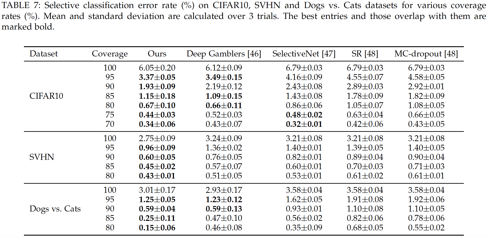

# Self-Adaptive Training for Selective Classification
This repository contains the PyTorch implementation of Selective Classification used in the 
- NeurIPS'2020 paper [Self-Adaptive Training: beyond Empirical Risk Minimization](https://arxiv.org/abs/2002.10319)，
- Journal version [Self-Adaptive Training: Bridging the Supervised and Self-Supervised Learning](https://arxiv.org/abs/2101.08732).


Self-adaptive training significantly improves the generalization of deep networks under noise and enhances the self-supervised representation learning. It also advances the state-of-the-art on *learning with noisy label*, *adversarial training* and the *linear evaluation* on the learned representation.

## News
- 2021.10: We have released the code for Selective Classification.
- 2021.01: We have released the journal version of Self-Adaptive Training, which is a unified algorithm for both the supervised and self-supervised learning. Code for self-supervised learning will be available soon.
- 2020.09: Our work has been accepted at NeurIPS'2020.

## Requirements

- Python >= 3.6
- PyTorch >= 1.0
- CUDA
- Numpy

## Usage
### Training and evaluating Selective Classification based on SAT
The `main.py` contains training and evaluation functions in standard training setting.
#### Runnable scripts
- Training and evaluation using the default parameters
  
  We provide our training scripts in directory `train.sh`. For a concrete example, we can use the command as below to train the default model (i.e., VGG16-BN) on CIFAR10 dataset:
  ```bash
  $ bash train.sh
  ```

- Additional arguments
  - `arch`: the architecture of backbone model, e.g., vgg16_bn
  - `dataset`: the trainiing dataset, e.g., cifar10
  - `loss`: the loss function for training, e.g., sat
  - `sat-momentum`: the momentum term of our approach


#### Results on CIFAR10, SVHN and Dogs&Cats datasets under various coverage rate
<p align="center">
    
</p>
<p align="center">
Self-Adaptive Training vs. prior state-of-the-arts on the Selective Classification at vaiours coverage rate.
</p>


## Reference
For technical details, please check [the conference version](https://arxiv.org/abs/2002.10319) or [the journal version](https://arxiv.org/abs/2101.08732) of our paper.

```
@inproceedings{huang2020self,
  title={Self-Adaptive Training: beyond Empirical Risk Minimization},
  author={Huang, Lang and Zhang, Chao and Zhang, Hongyang},
  booktitle={Advances in Neural Information Processing Systems},
  volume={33},
  year={2020}
}

@article{huang2021self,
  title={Self-Adaptive Training: Bridging the Supervised and Self-Supervised Learning},
  author={Huang, Lang and Zhang, Chao and Zhang, Hongyang},
  journal={arXiv preprint arXiv:2101.08732},
  year={2021}
}
```

## Acknowledgement
This code is based on:
- [Deep Gambler](https://github.com/Z-T-WANG/NIPS2019DeepGamblers)
- [pytorch-classification](https://github.com/bearpaw/pytorch-classification)

We thank the authors for sharing their code.

## Contact
If you have any question about this code, feel free to open an issue or contact laynehuang@pku.edu.cn.
